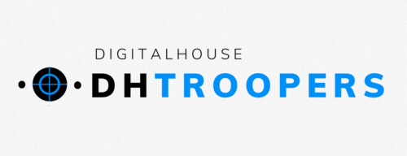

# PeriTroopers.com.ar

El sitio está dedicado a la venta de insumos informáticos, especialmente **accesorios y periféricos**.
Ofrece las mejores marcas de los mismos.

## Breve descripción de la oferta de productos

Los productos ofrecidos son aquellos conocidos como periféricos (de entrada y de salida), es decir, componentes o partes del equipo de la computadora que permiten introducir datos o información a la misma para que ésta los procese y/u ordene.


## ¿A quiénes va dirigido?

El sitio ofrece productos para el público en general, ya que los accesorios y periféricos son utilizados tanto en el ámbito del hogar, como en oficinas. 

## Referencias
Todo en la vida requiere de inspiración, ninguna idea surge de la nada. 

```JavaScript
let referentes = [{
        id: 1,
        website: "https://compragamer.com/",
        motivo: "Estructura sencilla"
    },
    {
        id: 2,
        website: "https://www.compugarden.com.ar/",
        motivo: "Estructura y diseño"
    },
    {
        id: 3,
        website: "https://musimundo.com",
        motivo: "Funcionalidades y estructura"
    },
    {
        id: 4,
        website: "https://mercadolibre.com.ar",
        motivo: "Innovación y funcionalidades"
    },
    {
        id: 5,
        website: "https://ed.team",
        motivo: "Interruptor modo oscuro, otras funcionalidades interesantes y estética"
    }
];
```

## ¿Quiénes somos? 
Somos **DH-troopers** y nuestro genial equipo está conformado por tres integrantes:

```JavaScript
let grupo = [{
    nombreCompleto: "Clara Mayorga",
    ocupacion: "Contadora pública",
    cumpleanios: "19 de junio",
    apodo: "Clarita"
},
{
    nombreCompleto: "Matías Benavide",
    ocupacion: "Estudiante",
    cumpleanios: "8 de julio",
    apodo: "Yisus"
},
{
    nombreCompleto: "Fernanda Ríos",
    ocupacion: "Militar, estudiante y mamá",
    cumpleanios: "27 de mayo",
    apodo: "Pei"
}];
```

¿Querés ver como trabajamos este Sprint? Visitá [nuestro tablero de Sprint 7](https://trello.com/b/ddauf4ZZ/sprint-7) en Trello.


